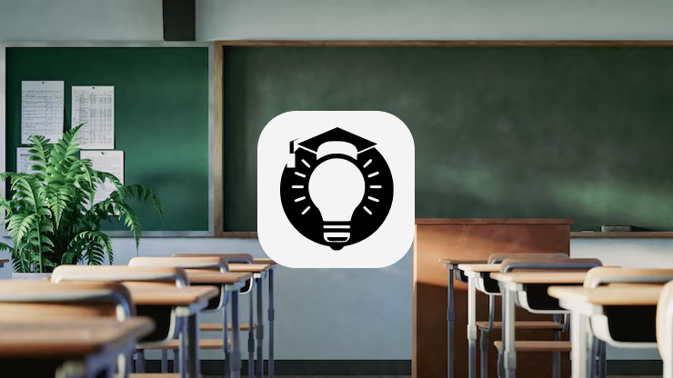

<p align="center">
  
</p>

<h1 align="center">SmartSchool Vision</h1>

<p align="center">
  <strong>Edge-first AI campus operations platform</strong><br>
  Privacy-aware computer vision for classroom monitoring, attendance intelligence, and safety-event response.
</p>

<p align="center">
  
  
  
  
  
</p>

> [!IMPORTANT]
> This repository is an educational prototype and research-oriented platform. It is not a medical, disciplinary, or production surveillance product. Any deployment involving minors, biometrics, emotion inference, or safety alerts must include consent, legal review, human oversight, retention limits, and a documented governance process.

## Overview

SmartSchool Vision is a modular vision-driven school operations system built around a FastAPI control plane, a local camera runtime, and a browser dashboard. The project combines classroom attendance analytics, role-aware event processing, and a local edge AI runtime for people, pose, object, and safety detection.

### What the project does

- Real-time camera capture with reconnect and frame-skipping logic
- Local face matching against a managed known-faces gallery
- YOLO-based detection for reflectors, pose, safety events, and emotion signals
- WebSocket event ingestion and centralized handler routing
- Attendance, roster, schedule, and analytics views in one control plane
- Desktop launchers for edge-first local operation
- Secure session handling and atomic JSON updates

## Product Preview

<p align="center">
  
</p>

The repository intentionally excludes identifiable people, faces, account databases, runtime logs, and model weights from Git. The visuals above are clean demo assets and non-identifying UI previews.

## Architecture

```text
Camera / RTSP / webcam
        |
        v
Edge vision runtime (:5000)
  OpenCV + YOLO + Face recognition
        |  WebSocket events + MJPEG frames
        v
FastAPI control plane (:8005)
  auth -> registry -> handlers -> services
        |                           |
        v                           v
SQLite sessions               JSON storage / analytics
        |
        v
Dashboard / team tools / attendance / schedule
```

## Graphify Analysis

A Graphify pass over the source code produced a strong architectural map:

- 364 nodes
- 774 edges
- 22 communities
- 0 import cycles detected

The highest-value architectural hubs are:

- `SessionData`
- `handle_register()`
- `read_json_safe()`
- `process_frame()`
- `handle_camera_event()`
- `update_json_atomic()`
- `sanitize_camera_id()`
- `KnownFaceManager`

Graphify also highlights a useful architectural insight: the two large vision runtimes are currently the most cohesive candidates for future refactoring into cleaner capture, inference, tracking, alerting, and transport layers.

### Graphify artifacts

- [Open interactive architecture graph](graphify-out/graph.html)
- [Read the architecture report](graphify-out/GRAPH_REPORT.md)
- [Explore graph JSON export](graphify-out/graph.json)

## Repository Structure

```text
handlers/       WebSocket action handlers
services/       Users, cameras, stats, storage services
utils/          Security and path utilities
site/           Server-rendered HTML entry points
static/         Frontend assets and UI scripts
aи/             Edge AI runtime and launcher layer
graphify-out/   Visual architecture graph and analysis
main.py         FastAPI backend entry point
launcher.py     Desktop launcher entry point
```

## Quick Start

### 1) Backend + dashboard

```powershell
py -3.11 -m venv .venv
.\.venv\Scripts\Activate.ps1
python -m pip install -r requirements.txt
Copy-Item .env.example .env
python main.py
```

Then open:

- `http://127.0.0.1:8005/login`

### 2) Full edge runtime

```powershell
python -m pip install -r requirements-ai.txt
python launcher.py
```

The edge service expects the main backend on port `8005` and exposes its local camera interface on port `5000`.

## Configuration

Copy `.env.example` to `.env` and configure the environment for your local deployment.

| Variable | Purpose |
| --- | --- |
| `APP_PORT` | FastAPI control-plane port |
| `FACE_API_BASE` | Edge vision HTTP endpoint |
| `KNOWN_FACES_DIR` | Private local gallery for face embeddings |
| `REFLECTOR_MODEL` | Object detector weights |
| `EMOTION_MODEL` | Emotion model weights |
| `WEAPON_MODEL` | Safety-event model weights |
| `POSE_MODEL` | Pose model weights |

## Privacy and Security Notes

- Passwords are hashed with bcrypt.
- Sessions are stored with random URL-safe identifiers and expiry.
- WebSocket actions pass through centralized role checks.
- Camera identifiers are sanitized before filesystem use.
- Sensitive runtime artifacts are excluded through `.gitignore`.

> Before production use, add TLS, secrets management, retention/deletion policy, audit logging, rate limiting, and formal human oversight.

## Development Notes

The project still includes research artifacts and alternate AI scripts. The recommended next step is to consolidate the duplicated vision runtimes, abstract the model adapters behind interfaces, and move operational storage onto a migration-managed database.

Run a syntax check without starting the camera stack:

```powershell
python -m compileall -q .
```

## License

Released under the [MIT License](LICENSE). Model weights, datasets, training assets, and third-party media are not bundled in this repository and may be governed by separate terms.

